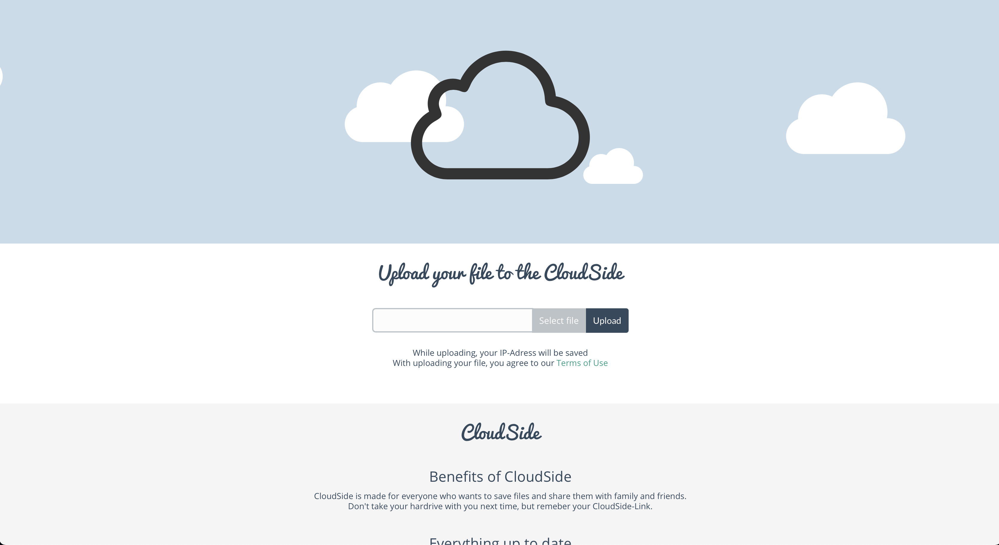
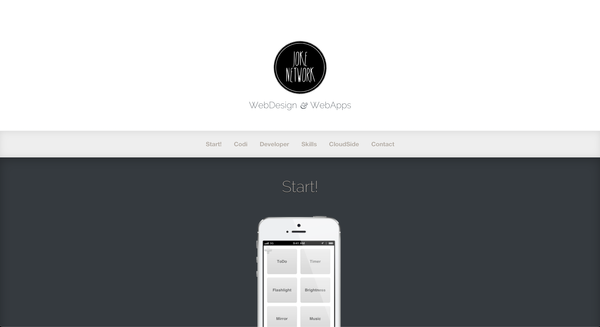
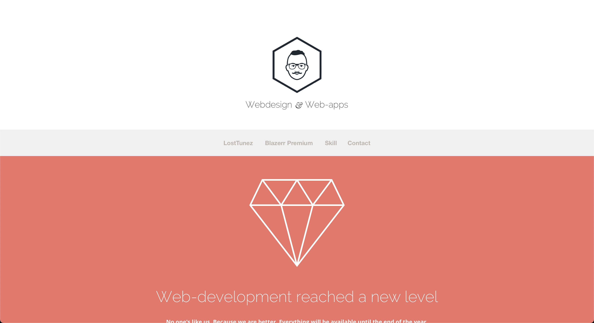
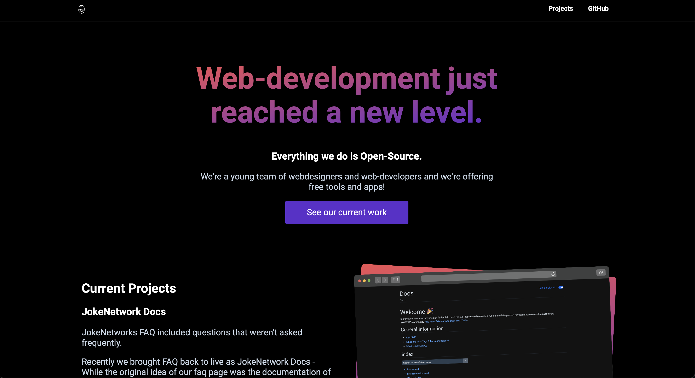

 
 <h1 align="center">JokeNetwork.de</h1>
 
v2.0 of our website

  

  
	
  
	
	
	
  

Welcome to `v2.0` of our website!

We're live at <https://jokenetwork.de>.

## 🖥 Version overview

|||||
|--------------------------------------------|-------------|-----------|-----------|
| `v1` - 2011 (JokeNetwork was CloudSide then) | `v0.5` - 2013 | `v1` - 2014 | `v2` - 2021 |

## 🤝 Credits 

This repo uses:

- [JQuery](https://jquery.com)

## 👩‍⚖️ License

All text and code in this repository is licensed under [CC BY-SA 4.0](https://creativecommons.org/licenses/by-sa/4.0/).
